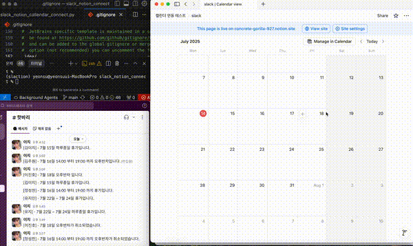

# Slack-Notion Calendar Connect
**Slack**에서 휴가 신청/취소 메시지를 읽어 **Notion 캘린더 데이터베이스**에 자동으로 반영하는 Python 스크립트

업무를 하면서 팀원들의 휴가 및 일정을 한눈에 파악할 수 있는 효율적인 툴의 필요성을 느꼈습니다. 외부 시스템(Flex)에서 휴가가 등록되면 슬랙 채널에만 알림이 올라오지만, 메세지 형태여서 특정 날짜, 월 등의 휴무자를 한 눈에 확인하기가 어려웠습니다.
노션 캘린더를 도입했지만 데이터를 재차 노션 캘린더에 수동으로 입력해야 하는 번거로움이 있었습니다.

이러한 반복적이고 비효율적인 과정을 자동화하고자, 슬랙 메시지를 읽어 노션 캘린더에 자동으로 반영하는 스크립트를 직접 개발하게 되었습니다.

## 시연 영상


```bash
ffmpeg -i snconnect_play.mov -vf "fps=10,scale=600:-1:flags=lanczos" -c:v gif snconnect_play.gif
```

---

## 주요 기능

- Slack 채널에서 최근 휴가 관련 메시지(신청/취소) 자동 수집
- 메시지 패턴 분석(연차, 반차, 날짜 범위, 취소 등)
- Notion 캘린더 데이터베이스에 휴가 정보 자동 등록/삭제
- 중복 휴가 데이터 방지

## 사용 라이브러리
1. slack_sdk
- Slack API와 연동하여 슬랙 채널의 메세지를 읽어오는데 사용.
- Slack Bot Token을 이용해 WebClient 객체를 생성하고, `conversations_history` 메서드로 최근 메세지 조회

2. requests
- HTTP 요청 처리를 위해 사용

3. dotenv
- DB ID, API Token 정보와 같은 민감한 환경변수를 안전하게 관리

4. re
- 메세지에서 데이터를 추출하기 위해 정규표현식 사용

5. ssl, certifi
- Slack SDK 통신에서 SSL 인증서 문제를 방지하기 위해 사용
- certifi가 최신 루트 인증서 번들을 제공하여 안전한 HTTPS 통신 환경 구성

---

## 사용 방법

### 1. 환경 변수 설정

`.env` 파일을 프로젝트 루트에 생성하고 아래 항목을 입력하세요.

```env
SLACK_TOKEN=슬랙_봇_토큰
SLACK_CHANNEL_ID=휴가신청_채널_ID
NOTION_TOKEN=노션_통합_토큰
NOTION_DATABASE_ID=노션_캘린더_데이터베이스_ID
```

### 2. 패키지 설치

```bash
pip install -r requirements.txt
```
또는 Poetry 사용 시:
```bash
poetry install
```

### 3. 실행

```bash
python slack_notion_callendar_connect.py
```

---

## Slack 메시지 템플릿

아래와 같은 형식의 메시지를 Slack에 입력하면 자동으로 인식됩니다.

- **하루종일 휴가:**  
  `홍길동 - 5월 10일 하루종일 휴가입니다.`
- **날짜 범위 휴가:**  
  `홍길동 - 5월 10일 ~ 5월 12일 휴가입니다.`
- **반차(오전/오후):**  
  `홍길동 - 5월 10일 오전`  
  `홍길동 - 5월 10일 오후`
- **휴가 취소:**  
  `홍길동 - 5월 10일 하루종일 휴가가 취소되었습니다.`

---

## Notion 데이터베이스 요구사항

- **Name** (title)
- **이름** (rich_text)
- **날짜** (date)
- **휴가유형** (select) : 연차/오후반차/오전반차